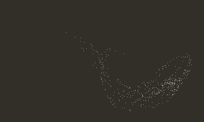
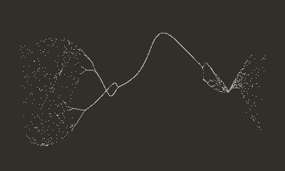
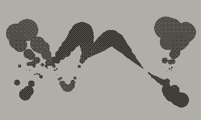
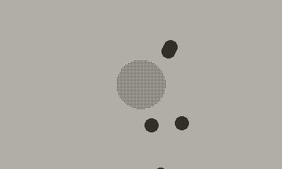

## Attractor
Playdate port of [coracle/drawings/ports/attractor](https://orllewin.github.io/coracle/drawings/ports/attractor/)



```lua
import 'Coracle/coracle'

local x = 0.0
local y = 0.0
local frame = 0
local f = 0
local change = 0

invertDisplay()

function playdate.update()
	background()
	
	change = crankChange()
	
	if(change < 0) then
		frame = frame - 1
	elseif(change > 0) then
		frame = frame + 1
	end
	
	f = frame/25.0
	
	for i = 0, 600, 1
	do
		x = x * cos(4 * (f/2) + y * 2) + y/4
		y = cos(x + y + x + f/3) - sin(i + x + f)/4
		point((width/2) + (x * (width/2.5)), (height/2) + (y * (height/3)))
	end
end
```
<hr>

## Filaments
Playdate port of [coracle/drawings/ports/filaments/](https://orllewin.github.io/coracle/drawings/ports/filaments/)



```lua
import 'Coracle/coracle'

local x = 0.0
local y = -1.00
local z = -1.00
local ii = 0

local frame = 0
local change = 0

invertDisplay()

function playdate.update()
	background()
	
	frame = frame + 4
		
	z = -1.00
	y = -1.00
	
	for i = -1000, 1000, 2
	do
		ii = i/1000.00
		x = ii * 2.4 + sin(z/52.0) / 5.0
		y = 4 * cos(ii * y - 2)
		z = 8 + y * sin(3 * ii + (frame/50.0)) * 20.0
		point((width/2) + (width/6) * x, (height/2) + z+y)
	end
end
```

The same 'filaments' code but optimised for Playdate, fewer steps, and change controlled by the crank:



```lua
import 'Coracle/coracle'

local x = 0.0
local y = -1.00
local z = -1.00
local ii = 0

local frame = 0
local change = 0

function playdate.update()
	background()
	
	change = crankChange()
	
	if(change < 0) then
		frame = frame - 4
	elseif(change > 0) then
		frame = frame + 4
	end
	
	z = -1.00
	y = -1.00
	
	for i = -100, 100, 2
	do
		ii = i/100.00
		x = ii * 2.4 + sin(z/52.0) / 5.0
		y = 4 * cos(ii * y - 2)
		z = 8 + y * sin(3 * ii + (frame/50.0)) * 20.0
		fill((8 - y/5)/10)
		circle((width/2) + (width/6) * x, (height/2) + z+y, 6 - z/4)
	end
end
```
<hr>

## Particles


```lua
import 'Coracle/coracle'
import 'Coracle/vector'

local maxSpeed = 2.2
local particleCount = 5

local blackhole = Vector(width/2, height/2)
local blackholeSize = 35
local blackholeMass = 0.4
local particles = {}

for i = 1 , particleCount do
	local boid = {}
	boid.location = Vector(math.random(width), math.random(height))
	boid.velocity = Vector(0, 0)
	table.insert(particles, boid)
end

function playdate.update()
	background()
	
	--Central Mass
	local crank = crankChange()
	if(crank > 0)then
		blackholeSize = blackholeSize + 0.75
		blackholeMass = blackholeMass + 0.01
	elseif (crank < 0) then
		blackholeSize = blackholeSize - 0.75
		blackholeMass = blackholeMass - 0.01
	end
	
	fill(0.25)
	circle(blackhole.x, blackhole.y, blackholeSize)
	  
	--Particles
	fill(1.0)

	for i = 1, particleCount do
		
		local body = particles[i]
		
		circle(body.location.x, body.location.y, 10)
		
		local blackholeDirection = vectorMinus(blackhole, body.location)
		blackholeDirection:normalise()
		blackholeDirection:times(blackholeMass)
		
		body.velocity:plus(blackholeDirection)
		body.location:plus(body.velocity)
		
	for j = 1, particleCount 
	do
		if (i ~= j) then
			local other = particles[j]
			bodyDirection = vectorMinus(body.location, other.location)
			bodyDirection:normalise()
			bodyDirection:times(0.04)
			body.velocity:plus(bodyDirection)
			body.velocity:limit(4.0)
			body.location:plus(body.velocity)
		end
	end
  end
end


```