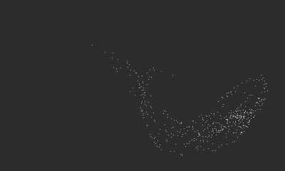

## Attractor
Playdate port of [coracle/drawings/ports/attractor](https://orllewin.github.io/coracle/drawings/ports/attractor/)



```lua
import 'Coracle/coracle'

local x = 0.0
local y = 0.0
local frame = 0
local f = 0
local change = 0

invertDisplay()

function playdate.update()
  background()
  
  change = crankChange()
  
  if(change < 0) then
	frame = frame - 1
  elseif(change > 0) then
	frame = frame + 1
  end
  
  f = frame/25.0
  
  for i = 0, 600, 1
  do
	x = x * cos(4 * (f/2) + y * 2) + y/4
	y = cos(x + y + x + f/3) - sin(i + x + f)/4
	point((width/2) + (x * (width/2.5)), (height/2) + (y * (height/3)))
  end
end
```