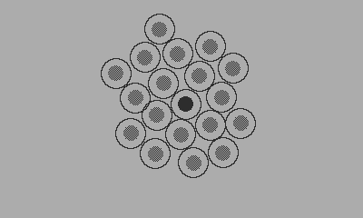

## Cells

```lua
import 'Coracle/coracle'
import 'Coracle/vector'

local maxSpeed <const> = 0.6
local cellWidth = 40.0
local cellRadius = cellWidth/2.0
local cellInnerRadius = cellWidth/4
local cells = {}

local centralMass = Vector(width/2, height/2)

local initial = {}
initial.location = Vector(width/2  + math.random(-5, 5), height/2 + math.random(-5, 5))
initial.velocity = Vector(0, 0)
table.insert(cells, initial)

playdate.startAccelerometer()

function playdate.update()
  background()
	
  for i = 1, #cells do
  
	local cell = cells[i]
	
	noFill()
	stroke()
	circle(cell.location.x, cell.location.y, cellRadius)
	
	fill(0.5)
	circle(cell.location.x, cell.location.y, cellInnerRadius)
	
	local centralMassDirection = vectorMinus(centralMass, cell.location)
	centralMassDirection:normalise()
	centralMassDirection:times(0.2)
	
	cell.velocity:plus(centralMassDirection)
	cell.location:plus(cell.velocity)
	
	local closestDistance = 1000.0
	local closestIndex = -1
	
	for j = 1, #cells do
	  if (i ~= j) then
		local other = cells[j]
		local dist = cell.location:distance(other.location)
		if(dist < closestDistance)then
			closestIndex = j
			closestDistance = dist
		end  
	  end
	end
	
	local distanceToMass = cell.location:distance(centralMass)
	if(distanceToMass < cellRadius * 2)then
	  local direction = vectorMinus(centralMass, cell.location)
	  direction:normalise()
	  direction:times(-0.9)
	  
	  cell.velocity:plus(direction)
	  cell.velocity:limit(maxSpeed)
	else
	  local closest = cells[closestIndex]
	  
	  if(closestDistance < cellWidth)then
		local direction = vectorMinus(closest.location, cell.location)
		direction:normalise()
		direction:times(-0.7)
		
		cell.velocity:plus(direction)
		cell.velocity:limit(maxSpeed)
	  end
	end
	
	cell.location:plus(cell.velocity)
	
	if(cell.location.y > height - cellRadius)then cell.location.y = height - cellRadius end
	if(cell.location.y < cellRadius)then cell.location.y = cellRadius end
	if(cell.location.x > width - cellRadius)then cell.location.x = width - cellRadius end
	if(cell.location.x < cellRadius)then cell.location.x = cellRadius end
  end
	
  -- Crank - change cell size/zoom level
  local crank = crankChange()
  if(crank > 0)then
	cellWidth = cellWidth + 1
	cellRadius = cellWidth/2.0
	cellInnerRadius = cellWidth/4
  elseif(crank < 0 and cellWidth > 20)then
	cellWidth = cellWidth - 1
	cellRadius = cellWidth/2.0
	cellInnerRadius = cellWidth/4
  end
  
  --Add new cell
  if(aPressed())then
	  local newCell = {}
	  newCell.location = Vector(width/2  + math.random(-5, 5), height/2 + math.random(-5, 5))
	  newCell.velocity = Vector(0, 0)
	  table.insert(cells, newCell)
  end
  
  --Remove a cell
  if(bPressed())then
	if(#cells > 1)then
	  local deleteIndex = math.random(#cells)
	  table.remove(cells, deleteIndex)
	end
  end
  
  -- Move food source/central mass
  -- Values are -1.0 to 1.0 we need it in form 0.0 to 1.0
  local x, y, z = playdate.readAccelerometer()
  centralMass.x = 400.0 * ((x + 1.0)/2.0)
  centralMass.y = 240.0 * ((y + 1.0)/2.0)
  fill(1.0)
  circleV(centralMass, cellInnerRadius)
  
  noFill()
  stroke()
  circleV(centralMass, cellRadius)
  
  fill(0.5)
  circleV(centralMass, cellInnerRadius)
end
```