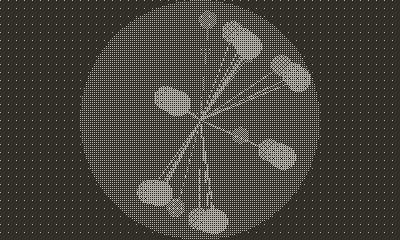

## Demoscene 01



```lua
import 'Coracle/coracle'
import 'Coracle/vector3d'


invertDisplay()

local particles = {}

local z = 275/pi
local t = 0.0

local movement = 1
local change = 0
local drawLines = false
local wireframe = false
local drawPrev = false
local drawStalks = false

local prevX = 0
local prevY = 0

for x = 0, 5 do
	for y = 0, 5 do
		table.insert(particles, Vector3D(-360 + (x * 80), -360 + ( y * 80), z))
	end
end

function playdate.update()	
	background()

	fill(0.01)
	rect(0, 0, 400, 240)
	
	fill(0.25)
	circle(200, 120, 120)
	
	change = crankChange()
	
	if(change > 0)then
		movement += 0.05
	elseif (change < 0) then
		movement -= 0.05
	end
	
	for p = 1, #particles do
		local particle = particles[p]
		local mapped = mapToSphere(particle.x - cos(t/100) * 300 + t, particle.y + sin(t/100) * (sin(particle.x/100) * 300), particle.z)
		
		local x = mapped:isoX(200)
		local y = mapped:isoY(120)
		local r = map(mapped.z, -100, 100, 18, 2)
		if not wireframe then 
			fill(r/17)
		else
			noFill()
			stroke()
		end
		circle(x, y, r )
		
		if drawPrev and random(100) > 50 then 
			fill(r/17)
			--playdate.graphics.drawSineWave(x, y, prevX, prevY, math.max(1, r), 0, math.max(1, r), math.max(1, r))
			line(x, y, prevX, prevY) 
		end
		
		prevX = x
		prevY = y
		
		if drawStalks then line(x, y, 200, 120) end
	end
			
	if random(100) < 3 then wireframe = not wireframe end
	
	if wireframe then
		if random(100) < 10 then wireframe = false end
	end
	
	if random(100) < 3 then drawPrev = not drawPrev end
	
	if drawPrev then
		if random(100) < 6 then drawPrev = false end
	end
	
	if random(100) < 3 then drawStalks = not drawStalks end
	
	if drawStalks then
		if random(100) < 6 then drawStalks = false end
	end
	
	t += 1.5
end

function mapToSphere(x, y, radius)
	local longitude = x / radius /0.85
	local latitude = movement * math.atan(e^(y/radius)) - pi/8
	return Vector3D(radius * cos(latitude) * cos(longitude),  radius * cos(latitude) * sin(longitude),  radius * sin(latitude))
end
```