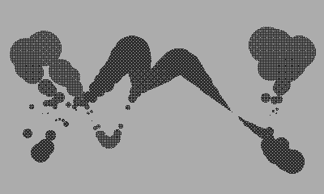

## Filaments
Playdate port of [coracle/drawings/ports/filaments/](https://orllewin.github.io/coracle/drawings/ports/filaments/)


```lua
import 'Coracle/coracle'

local x = 0.0
local y = -1.00
local z = -1.00
local ii = 0

local frame = 0
local change = 0

invertDisplay()

function playdate.update()
  background()
  
  frame = frame + 4
	
  z = -1.00
  y = -1.00
  
  for i = -1000, 1000, 2
  do
	ii = i/1000.00
	x = ii * 2.4 + sin(z/52.0) / 5.0
	y = 4 * cos(ii * y - 2)
	z = 8 + y * sin(3 * ii + (frame/50.0)) * 20.0
	point((width/2) + (width/6) * x, (height/2) + z+y)
  end
end
```

The same 'filaments' code but optimised for Playdate, fewer steps, and change controlled by the crank:



```lua
import 'Coracle/coracle'

local x = 0.0
local y = -1.00
local z = -1.00
local ii = 0

local frame = 0
local change = 0

function playdate.update()
  background()
  
  change = crankChange()
  
  if(change < 0) then
	frame = frame - 4
  elseif(change > 0) then
	frame = frame + 4
  end
  
  z = -1.00
  y = -1.00
  
  for i = -100, 100, 2
  do
	ii = i/100.00
	x = ii * 2.4 + sin(z/52.0) / 5.0
	y = 4 * cos(ii * y - 2)
	z = 8 + y * sin(3 * ii + (frame/50.0)) * 20.0
	fill((8 - y/5)/10)
	circle((width/2) + (width/6) * x, (height/2) + z+y, 6 - z/4)
  end
end
```