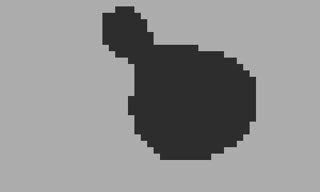

## Metaballs


This runs slower on hardware (7fps versus 23fps from the simulator above), the particle logic is from [Particles](https://github.com/orllewin/playdate_coracle#particles) below.

```lua
import 'Coracle/coracle'
import 'Coracle/vector'

scaleDisplay(8)

local maxSpeed = 0.9
local particleCount = 3

local blackhole = Vector(width/2, height/2)
local blackholeMass = 0.12

--Metaball fields
local xD = 0
local yD = 0
local sum = 0
local p = nil

local particles = {}

for i = 1 , particleCount do
  local particle = {}
  particle.location = Vector(math.random(width), math.random(height))
  particle.velocity = Vector(0, 0)
  particle.r = math.random(1,2)
  table.insert(particles, particle)
end

function playdate.update()
  background()
  
  --Central Mass
  local crank = crankChange()
  if(crank > 0)then
	blackholeMass = blackholeMass + 0.01
  elseif (crank < 0) then
	blackholeMass = blackholeMass - 0.01
  end
	
  for i = 1, particleCount do
	
	local body = particles[i]
		
	local blackholeDirection = vectorMinus(blackhole, body.location)
	blackholeDirection:normalise()
	blackholeDirection:times(blackholeMass)
	
	body.velocity:plus(blackholeDirection)
	body.location:plus(body.velocity)
	
	for j = 1, particleCount do
	  if (i ~= j) then
		local other = particles[j]
		bodyDirection = vectorMinus(body.location, other.location)
		bodyDirection:normalise()
		bodyDirection:times(0.04)
		body.velocity:plus(bodyDirection)
		body.velocity:limit(maxSpeed)
		body.location:plus(body.velocity)
	  end
	end
  end
  
  --Metaballs
  for x = 0, width do
	for y = 0, height do
	  sum = 0
	  for i = 1, #particles do
		p = particles[i]
		xD = p.location.x - x
		yD = p.location.y - y
		sum += p.r / math.sqrt(xD * xD + yD * yD)
	  end

	  if(sum > 0.7)then
		point(x, y)
	  end
	end
  end
  
  --For optimising, draw FPS on-screen:
  --playdate.drawFPS(1, 1)
end
```