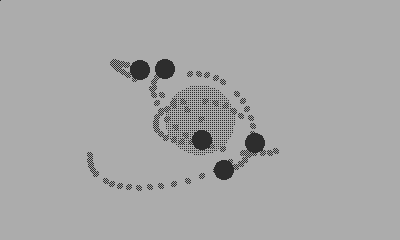

## Particles with tails


```lua
import 'Coracle/coracle'
import 'Coracle/vector'

local maxSpeed = 2.2
local particleCount = 5
local tailLength = 20
local frame = 0

local blackhole = Vector(width/2, height/2)
local blackholeSize = 35
local blackholeMass = 0.4
local particles = {}

for i = 1 , particleCount do
  local boid = {}
  boid.location = Vector(math.random(width), math.random(height))
  boid.velocity = Vector(0, 0)
  boid.tailXs = {}
  boid.tailYs = {}
  
  for t = 1, tailLength do
	boid.tailXs[t] = -1
	boid.tailYs[t] = -1
  end
  table.insert(particles, boid)
end

function playdate.update()
  background()
  frame = frame + 1
  
  --Central Mass
  local crank = crankChange()
  if(crank > 0)then
	blackholeSize = blackholeSize + 0.75
	blackholeMass = blackholeMass + 0.01
  elseif (crank < 0) then
	blackholeSize = blackholeSize - 0.75
	blackholeMass = blackholeMass - 0.01
  end
  
  fill(0.25)
  circle(blackhole.x, blackhole.y, blackholeSize)
	
  --Particles
  fill(1.0)

  for i = 1, particleCount do
	
	local body = particles[i]
	
	fill(1.0)
	circle(body.location.x, body.location.y, 10)
	
	local tailIndex = frame % tailLength
	body.tailXs[tailIndex] = body.location.x
	body.tailYs[tailIndex] = body.location.y
	
	fill(0.5)
	for t = 1, tailLength do
	  circle(body.tailXs[t], body.tailYs[t], 3)
	end
	
	local blackholeDirection = vectorMinus(blackhole, body.location)
	blackholeDirection:normalise()
	blackholeDirection:times(blackholeMass)
	
	body.velocity:plus(blackholeDirection)
	body.location:plus(body.velocity)
	
  for j = 1, particleCount 
  do
	if (i ~= j) then
	  local other = particles[j]
	  bodyDirection = vectorMinus(body.location, other.location)
	  bodyDirection:normalise()
	  bodyDirection:times(0.04)
	  body.velocity:plus(bodyDirection)
	  body.velocity:limit(4.0)
	  body.location:plus(body.velocity)
	end
  end
  end
end
```
