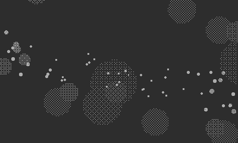

## Pseudo 3D Floating Spheres


A port of the [Coracle drawing](https://orllewin.github.io/coracle/drawings/experiments/pseudo_sphere/), which is a port of [gist.github.com/volfegan/Pseudo3D_floating_spheres.pde](https://gist.github.com/volfegan/98044f8ebba0e728fabfcfc3ca2dea59)

```lua
import 'Coracle/coracle'

local t = 0.0
local donut = false
local cameraZ = 7.0
local cX = width/2
local cY = height/2

invertDisplay()

function playdate.update()
  background()
  
  if(aPressed()) then	donut = not donut end
  
  change = crankChange()
  
  if(change < 0) then
    if(cameraZ > 5)then
      cameraZ -= 0.1
    end
  elseif(change > 0) then
    if(cameraZ < 12)then
      cameraZ += 0.1
    end
  end
  
  t += 0.04
  
  for i = 90, 0, -1  do
  
    local q = (i * i)
    local sQ = sin(q)
    
    local b
    if(donut)then
      b = i % 6 + t + i
    else
      b = i % 6 + t
    end
  
    local p = i + t
    local z = cameraZ + cos(b) * 3 + cos(p) * sQ
    local s = 100 / z / z
    
    fill(1/(s * 0.35))
    
    circle((cX * (z + sin(b) * 5 + sin(p) * sQ) / z), (cY + cX * (cos(q)- cos(b+t))/z), s)
  end
end
```