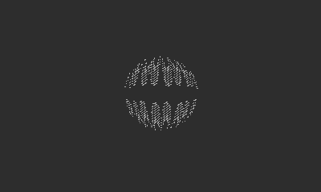

## Pseudo 3D Sphere


A port of the [dwitter.net/d/23879](https://beta.dwitter.net/d/23879), just to try and figure out what's going on in that heavily compressed optmised code. This will not run well on hardware, so don't even try.

```lua
import 'Coracle/coracle'

invertDisplay()

local hW = width/5
local xA = 125
local yA = 70
local t = 0.0

function playdate.update()	
  background()
  
  t += 0.05
  
  local z= 0.0 + width/4
  local w = 0.0 + width/3
  
  for m = 13800, 0, -4 do
    local i = m % w
    local j = m / w
    playdate.graphics.fillRect(xA + i, yA + j, 1/z, z) 
    local g = 2.5 + cos(t)
    local Y = j / hW * g - g / 1.7
    local X = ((i / hW) * g) - g
    
    local r = X * X + Y * Y
    local d = 0
    if(r > 1)then
      d = 0
    else
      d = cos(r) / 9
    end
    
    z = cos(X / d - t * 11) * Y/4 / d
  end
end
```