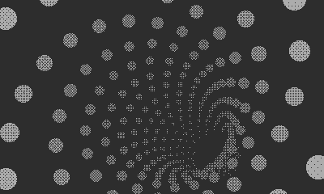

## Tunnel


A port of the [Coracle drawing](https://orllewin.github.io/coracle/drawings/ports/tunnel/), which is a port of a [Dwitter sketch](https://www.dwitter.net/d/26555)

```lua
import 'Coracle/coracle'

invertDisplay()

local frame = 0
local z = 0
local a = 0
local aW = 0
local x = 0
local y = 0
local yOffset = -60

function playdate.update()	
  background()
  
  frame += 4
  
  for i = 350, 1, -1 do
    z = width * 25/i
    a = i + frame 
    aW = sin(a/300)
    x = sin(a) * z + ((aW * 1.1) + 2) * 90
    y = cos(a) * z + ((aW / 1.1) + 2) * 90
    fill(z/230)
    circle(x, y + yOffset,  z/15)
  end
end
```