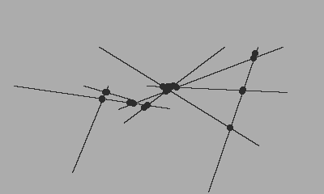

## Walking Lines


```lua
import 'Coracle/coracle'
import 'Coracle/line'

local lines = {}
local lineCount = 8
local velocity = 4

for i = 1 , lineCount do
  local walkingLine = {}
  local line = Line(math.random(width), math.random(height), math.random(width), math.random(height))
  walkingLine.line = line
  walkingLine.x1Direction = 1
  if(math.random(100) > 50)then
    walkingLine.x1Direction = -1
  end
  walkingLine.y1Direction = 1
  if(math.random(100) > 50)then
    walkingLine.y1Direction = -1
  end
  walkingLine.x2Direction = 1
  if(math.random(100) > 50)then
    walkingLine.x2Direction = -1
  end
  walkingLine.y2Direction = 1
  if(math.random(100) > 50)then
    walkingLine.y2Direction = -1
  end
  table.insert(lines, walkingLine)
end

function playdate.update()
  background()
  
  for i = 1, lineCount do
    
    local walkingLine = lines[i]
    
    --update
    walkingLine.line.x1 += (velocity * walkingLine.x1Direction)
    walkingLine.line.y1 += (velocity * walkingLine.y1Direction)
    walkingLine.line.x2 += (velocity * walkingLine.x2Direction)
    walkingLine.line.y2 += (velocity * walkingLine.y2Direction)
    
    --check bounds
    if(walkingLine.line.x1 > width or walkingLine.line.x1 < 0)then
      walkingLine.x1Direction *= -1
    end
    
    if(walkingLine.line.y1 > height or walkingLine.line.y1 < 0)then
      walkingLine.y1Direction *= -1
    end
    
    if(walkingLine.line.x2 > width or walkingLine.line.x2 < 0)then
      walkingLine.x2Direction *= -1
    end
    
    if(walkingLine.line.y2 > height or walkingLine.line.y2 < 0)then
      walkingLine.y2Direction *= -1
    end
    
    --look for intersections
    for j = 1, lineCount do
      if(j ~= i)then
        local otherWalkingLine = lines[j]
        local otherLine = otherWalkingLine.line
        local intersect = walkingLine.line:intersects(otherLine)
        if(intersect.x ~= -1)then
          circle(intersect.x, intersect.y, 4)
        end
      end
      
    end
    
    --draw
    walkingLine.line:draw()
    
  end
end
```